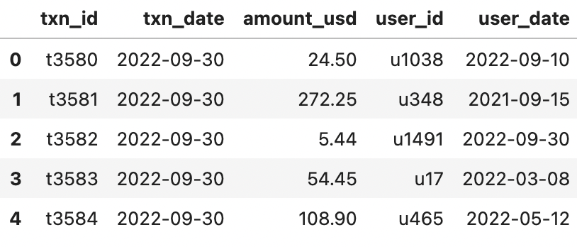
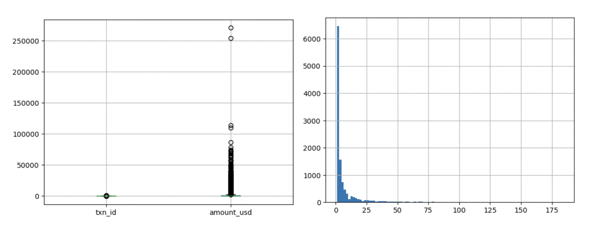
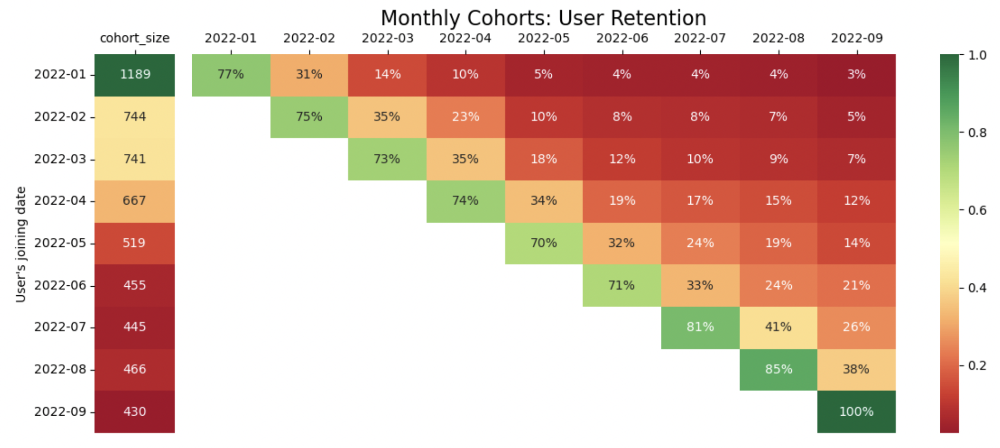
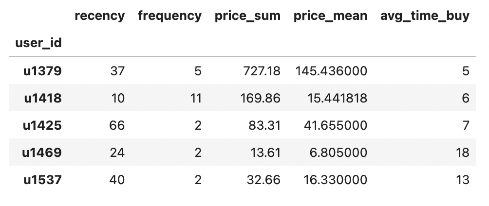
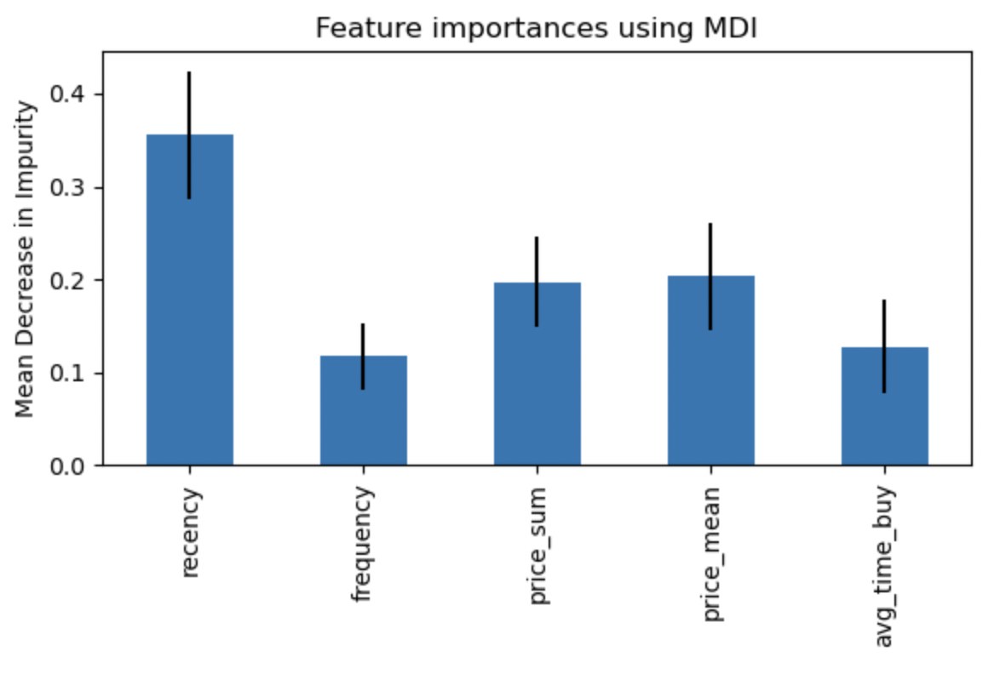
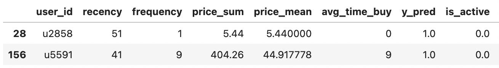
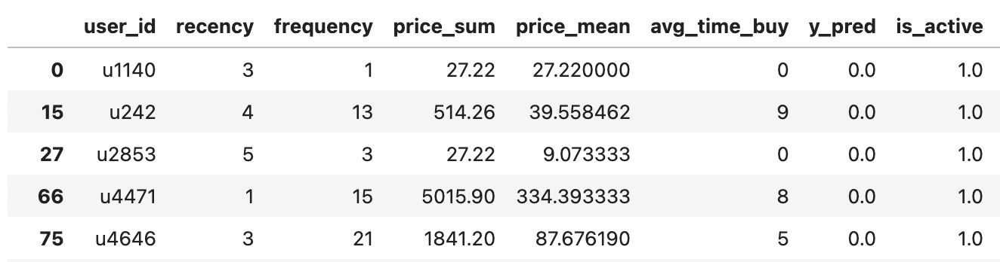
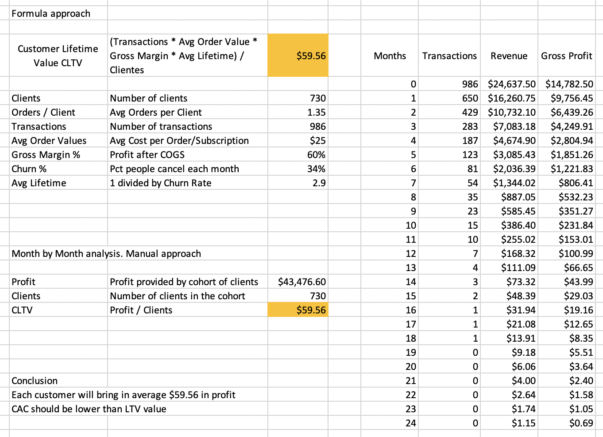

# Customer Analysis

Full customer analysis encompassing:
- Cohort and Retention analysis.
- Customer Lifetime Value calculation and analysis.
- RFM Analysis using Machine Learning.
- RFM Segmentation using Machine Learning.

## :boom: Exploratory Data Analysis

We have 9 month worth of data where each row represents one transaction. 
There is a total of 109.059 entries, however, after removing outliers, we will end up with 50.158 rows.

  

From left to right, a boxplot showing count and sum of transactions aggregated by user ID, and a histogram of the number of transactions aggregated by user ID. Most of the customers perfomed 10 transactions or less.

  

## :busts_in_silhouette: Cohort and Retention Analysis

A cohort is a group of customers that share similar features. When it comes to retention and churn analysis, we usually aggregate users by joining date. That is, users that joined during the same month will fall in the same cohort. 

  

On the left we have the number of unique customers per cohort while on the right the retention per cohort and month. Some conclusions are:
- 1. The number of users is declining month by month. 
- 2. First month (period) does not add up 100% this is due to the fact that there are users that didnt perform any purchase the month they joined.
- 3. Retention decreases fast, going from ~80% to ~15% during the first 3 months.

## :chart_with_upwards_trend: RFM Analysis with Machine Learning

RFM analysis is a marketing technique used to quantitatively rank and group customers based on the recency, frequency and monetary total of their recent transactions to identify the best customers and perform targeted marketing campaigns.

RFM analysis ranks each customer on the following factors:

- **Recency**  How recent was the customer's last purchase? Customers who recently made a purchase will still have the product on their mind and are more likely to purchase or use the product again. Businesses often measure recency in days. But, depending on the product, they may measure it in years, weeks or even hours.
- **Frequency** How often did this customer make a purchase in a given period? Customers who purchased once are often are more likely to purchase again. Additionally, first time customers may be good targets for follow-up advertising to convert them into more frequent customers.
- **Monetary Value** How much money did the customer spend in a given period? Customers who spend a lot of money are more likely to spend money in the future and have a high value to a business.
- **Other Metrics**  Additional metrics to tailor and align the model to the business as much as possible.

In our analysis, we create the following table:
- recency: When was the last purchase in days.
- frequency: Number of transactions. 
- price_sum: Addition of all transactions' amounts.
- price_mean: Average of all transactions' amounts.
- avg_time_buy: Average number of days between transactions.

  

### :deciduous_tree: Machine Learning Model

This machine learning model attempts to understand the each customer's behavior, it wont be used to predict what the user will be doing next, but to understand what each customer should have done giving its past performance. 

Since the first months of the year is where we have the most events, we will take January, February and March for training and the April as our test data.

The model is a Random Forest Classifier, it performs with a 90% accuracy for test data. 

Recency is the most important feature while avg_time_buy does not add too much to the model.

  

Once we have the model trained, we use it to predict what should have happened in the fourth month. Lastly we compare the prediction `y_pred` with the reality `is_active`. This will help us to answer the previously stated business questions.

### :grey_question: Business Questions

**Which customers had a high probability to transact but didnt do anything in the next 30 days.**

We compare `y_pred` and `is_active`. In other words we check those users who should have transacted according to our model, but actually, stayed dormant. By creating a tailored marketing campaign we could get these users attention and enhance engagement.

  

**Which customers have recently transacted but are unlikely to do it again.**

By comparing `recency` with `y_pred` and `is_active` we check what users were likely to use the service but didn't. This information could be useful to understand what might be happening in the industry as well as what we should change to make us more appealing to customers.

  

## :jigsaw: RFM Segmentation with Machine Learning

-- To do. 

## :hook: Customer Lifetime Value

CLV or CLTV is the total profit generated from one client over their lifetime, after COGS. It is a metric highly used by subscription base companies such as Ecommerce or SaaS. It is cheaper to retain a customer than to acquire a new one.

This metric is often compared with CAC (Customer Acquisition Cost). LTV should always be higher than your CAC, otherwise you are losing money. Simply put, what you pay to acquaire a customer should be less than what the customer will bring in terms of revenue. 

The following data is used to compute LTV:
- Number of clients in the cohort.
- Number of orders per client.
- Number of transactions done by the cohort of clients.
- Average order value.
- Gross Margin Percentage: How much you make after COGS are deducted.
- Churn Rate: How many customers dont come back.
- Average Lifetime in months: 1 divided by churn rate.

### Churn Rate
The number of clients that leave after using your service. The lower the rate the better. It is cheaper to sell to already existing users than acquiring new ones, thats why churn rate is an important metric to keep track of.

The challenge when it comes to analyzing churn rate is what values to use, not the equation impletentation (it is a simple percentage difference). The values (or the churn definition) that will be used should make sense.

8% is usually the threshold when it starts to become a problem. However, this number highly depends on the sector and industry.

Things to keep in mind when computing churn rate:
- Do not mix different products. You should be computing churn rates per product.
- For seasonal products. Compare YoY instead of MoM.
- If possible compare customer churn rate to revenue churn rate. This could give additional insight regarding the direction of the company.

### Lifetime value analysis

Lifetime value calculation may vary from business to business but in general termns it would be something like: 

`Average Total Order Amount * Average Number of Purchases Per Timeframe * Retention Rate`. 

For our example, however, we will be using the following equation:

`CLTV = (Transactions * Avg Order Value * Gross Margin * Avg Lifetime) / Number of Customers`.

  

According to our data, assumptions and CLTV equation, our customers will bring $59.56 on average in their lifetime. By comparing the equation and the manual approach, we ensure the accuracy of the equation. 

The excel file could be found within the data folder.

## :love_letter: Contact info

Doubts? Advice? Drop me a line! :smirk: